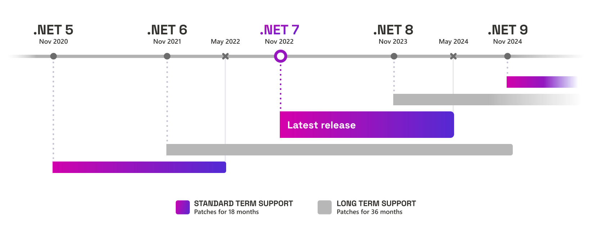
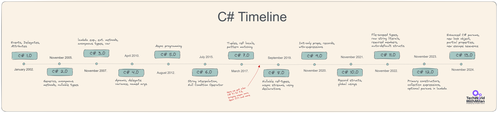
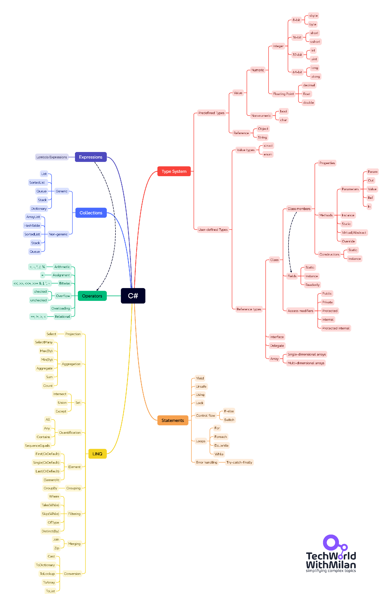

# .NET Developer Roadmap 2024.

This is a step-by-step guide to becoming a .NET Engineer, with links to relevant learning resources.

If you want to learn more about .NET technologies, be sure to subscribe to **[my newsletter](https://newsletter.techworld-with-milan.com/)**. 

## Disclaimer

> This roadmap aims to give you an idea about the landscape. The road map will guide you if you need clarification about what to learn next rather than encouraging you to pick what is hype and trendy. It would help if you grew some understanding of why one tool would be better suited for some cases than the other and remember that hype and trendy only sometimes mean best suited for the job.

## Give a Star! :star:

If you like or are using this project to learn or start your solution, please give it a star. Thanks!

## Roadmap (by seniority level)

Note that by seniority level, it means:

🟣 **Junior**: Basic concepts

🟤 **Medior**: Advanced concepts

🔴 **Senior**: Expert concepts

Download [PDF version](NET%20Roadmap.pdf).

## Minimalistic version

Below you can find a bare minimum version every junior .NET developer needs to know, with learning materials included and clickable in the PDF version.

Download [PDF version](NET%20Developer%20Roadmap%202024.%20Minimal.pdf).

## Table of Contents

- [Understanding the .NET ecosystem](#understanding-the-net-ecosystem)
  - [.NET runtimes](#net-runtimes)
    - [.NET Framework](#net-framework)
    - [.NET Core](#net-core)
    - [The One .NET - .NET 5](#the-one-net---net-5)
    - [The current - .NET 8](#the-current---net-8)
  - [.NET Standard](#net-standard)
- [Learning resources](#learning-resources)
  - [1. C#](#1-c)
  - [2. General Development Skills](#2-general-development-skills)
  - [3. ASP.NET Core](#3-aspnet-core)
  - [4. Client-Side .NET](#4-client-side-net)
  - [5. Databases](#5-databases)
  - [6. ORM](#6-orm)
  - [7. Caching](#7-caching)
  - [8. Logging](#8-logging)
  - [9. Communication](#9-communication)
  - [10. Background tasks](#10-background-tasks)
  - [11. Testing](#11-testing)
  - [12. Observability](#12-observability)
  - [13. Containerization](#13-containerization)
  - [14. Cloud](#14-cloud)
  - [15. Continuous Integration \& Delivery (CI/CD)](#15-continuous-integration--delivery-cicd)
  - [16. NET Libraries](#16-net-libraries)
  - [Additional considerations](#additional-considerations)
    - [Performance best practices](#performance-best-practices)
    - [Profiling and diagnostics](#profiling-and-diagnostics)
    - [Performances 101](#performances-101)
    - [Security and Cryptography](#security-and-cryptography)
  - [Additional learning resources](#additional-learning-resources)
    - [Books](#books)
    - [YouTube Channels](#youtube-channels)
    - [Blogs](#blogs)
    - [Podcasts](#podcasts)
    - [Other .NET Content creators](#other-net-content-creators)
- [Tools](#tools)

## Understanding the .NET ecosystem

Before going into specifics, you need to have a solid understanding of the **.NET Ecosystem**. Here are a few that you should understand:

## .NET runtimes

In this section, we will look at the main .NET runtimes. We consider .NET runtime as anything that implements **[ECMA-335 Standard for .NET](https://github.com/dotnet/coreclr/blob/master/Documentation/project-docs/dotnet-standards.md)**.

### .NET Framework

[.NET Framework](https://dotnet.microsoft.com/en-us/download/dotnet-framework) is a software development framework for building and running applications on Windows. .NET Framework consists of Common Language Runtime (CLR), .NET Framework Class Library, and Application workloads (WPF, Windows Forms, and ASP.NET). CLR is part of a shared infrastructure that runs code, jit, does garbage collection (C#, VB.NET, F#), etc. The code that CLR manages is called managed code. Code is compiled into Common Intermediate Language (CIL) and stored in assemblies (with .exe or .dll extension). When an application runs, CLR takes an assembly and uses a just-in-time compiler (JIT) to transpile machine code into code that can run on specific computer architecture.

You can use it for both desktop and web development, but it is limited to Windows development, and it comes preinstalled on Windows.

### .NET Core

[.NET Core](https://dotnet.microsoft.com/en-us/download) is one of the runtimes in the .NET Ecosystem. It was released in 2016. and it's [open-sourced](https://github.com/dotnet/core). It does not represent a new version of the .NET Framework and will not replace it. It is an entirely independent version, built to allow cross-platform capability for application development. .NET Core consists of an App Host (dotnet.exe) that runs CLR and Library. It has a Common language runtime (CoreCLR) and .NET Core Class Library. It supports different application workloads, such as ASP.NET Core (MVC and API), console applications, and UWP (currently).

.NET Core can run on different platforms: Windows Client, Server, IoT, Linux, Ubuntu, FreeBSD, Tizen, and Mac OSX, and can be installed side-by-side of different versions per machine or user.

### The One .NET - .NET 5

[.NET 5](https://dotnet.microsoft.com/en-us/download/dotnet/5.0) was released in November 2020 with the goal of unifying development for desktop, Web, cloud, mobile, gaming, IoT, and AI applications. The earlier setup goal was to produce a single .NET runtime and framework, cross-platform, integrating the best features of .NET Core, .NET Framework, Xamarin, and Mono. However, due to the global health pandemic, the unification was postponed to .NET 6. .NET 5 is a shared code base for .NET Core, Mono, Xamarin, and future .NET implementations. Also, target framework names (TFMs), which express which version of .NET targeting, are updated, so we now have net5.0. This is for code that runs everywhere. It combines and replaces the netcoreapp and netstandard names and net5.0-windows that represent OS-specific flavors of .NET 5 that include net5.0 plus OS-specific bindings.

### The current - .NET 8

[.NET 8](https://learn.microsoft.com/en-us/dotnet/core/whats-new/dotnet-8) is the latest runtime in the .NET Ecosystem. It is released in November 2023. and it unifies development for desktop, Web, cloud, mobile, gaming, IoT, and AI applications. .NET 8 consists of an App Host (dotnet.exe) that runs CLR and Library. It has a Common language runtime (CoreCLR) and .NET 8 Class Library. It also includes ASP.NET Core 8. .NET 8 has nearly identical platform support as .NET Core 3.1 for Windows, macOS, and Linux.

.NET 8 is a **Long Term Support (LTS)**. Those releases are supported for three years after the initial release.

.NET 7 was a **Standard Term Support** release, supported for six months after a subsequent STS or LTS release.

## .NET Standard

Different runtimes use different class libraries, e.g., .NET Framework uses .NET Framework class library, while .NET Core contains its class library, as well as Xamarin with its class library. In this way, it's hard to share code between different runtimes, as they use different APIs. Microsoft's solution is the **.NET Standard library**, released in 2016. It represents a set of (formal) specifications that say which APIs you can use and all runtimes implement it. It is the evolution of Portable Class Libraries (PCL). Specific runtimes implement specific versions of .NET Standard (implementing specific APIs). E.g., .NET Framework 4.8.1 implements .NET Standard 2.0, and .NET 7 implements .NET Standard 2.1 ([link](https://learn.microsoft.com/en-us/dotnet/standard/net-standard?tabs=net-standard-1-0#net-implementation-support)).

To learn more about the .NET Ecosystem, check [this blog post](https://milan.milanovic.org/post/a-brief-walk-through-net-ecosystem/).

**.NET Release Schedule by Microsoft:**

## Learning resources

### 1. C#

C# is a programming language developed by Microsoft. It's a language for building anything from desktop applications and games (using Unity) to cloud-based solutions and web services. With **strong support for object-oriented programming** and a rich library, it's designed to be easy and efficient. 

The latest version is **[C# 12](https://learn.microsoft.com/en-us/dotnet/csharp/whats-new/csharp-12)**, released in November 2023.

Check the full C# timeline:

You need to understand different **C# language features**, such as:

- Object-oriented programming (classes, objects, interfaces, inheritance, polymorphism)
- Variables, data types, and operators
- Reference and value types
- Control flow (conditionals, loops)
- Generics
- Exception handling
- Delegates and events
- Assemblies
- Collections
- LINQ (Language Integrated Query)
- Async and await for asynchronous programming

But also **.NET libraries and APIs** for:

- File I/O and serialization
- Collections and data structures
- Networking 
- Multithreading and task parallelism
- Security and cryptography

**Resources**:

- [Microsoft Learn C#](https://dotnet.microsoft.com/en-us/learn/csharp).
- [Microsoft C# Fundamentals for Absolute Beginners](https://learn.microsoft.com/en-us/shows/c-fundamentals-for-absolute-beginners/).
- [Microsoft C# 101](https://learn.microsoft.com/en-us/shows/csharp-101/)
- [Udemy C# for Beginners - Coding From Scratch (.NET Core)](https://www.udemy.com/course/c-and-net-core-for-beginners/)
- [C# Basics for Beginners: Learn C# Fundamentals by Coding](https://www.udemy.com/course/csharp-tutorial-for-beginners/)
- Learn [dotnet CLI](https://docs.microsoft.com/dotnet/core/tools)
- [NuGet](https://learn.microsoft.com/en-us/nuget/what-is-nuget) package manager
- [Dot Net Perls](https://www.dotnetperls.com/s#c#) - Many code examples in C#
- Advanced concepts:
    - [Become a Full-stack .NET Developer - Advanced Topics](https://www.pluralsight.com/courses/full-stack-dot-net-developer)
    - [Async/Await](https://devblogs.microsoft.com/dotnet/how-async-await-really-works/) by Stephen Toub
    - [Threading in C#](https://www.albahari.com/threading/) by Joseph Albahari
    - [Concurrency](https://www.codeguru.com/csharp/thread-synchronization-c-sharp/) and [Locking](https://learn.microsoft.com/en-us/dotnet/csharp/language-reference/statements/lock)
- [C# language specification - ECMA-334](https://www.ecma-international.org/publications-and-standards/standards/ecma-334/)

### 2. General Development Skills

Mastering design patterns, clean code, and version control like Git enables you to write efficient, maintainable code that works and thrives in a team environment. It's the **difference between being a coder and a skilled software engineer**.

Here, you need to know different principles, such as:

**SOLID Principles**:
  - Single Responsibility Principle (SRP)
  - Open/Closed Principle (OCP)
  - Liskov Substitution Principle (LSP)
  - Interface Segregation Principle (ISP)
  - Dependency Inversion Principle (DIP)

But also:

- DRY (Don't Repeat Yourself)
- KISS (Keep It Simple, Stupid)
- YAGNI (You Ain't Gonna Need It)
- Law of Demeter (LoD) or Principle of least knowledge
- Composition over Inheritance
- The principle of least astonishment
- Software architecture styles and patterns (MVC, MVP)

**Resources**:

- Learn [Git](https://newsletter.techworld-with-milan.com/p/how-to-learn-git)
- Learn [Data Structures & Algorithms](https://amzn.to/3LTsZ6o)
- Learn [Clean Code](https://amzn.to/3Qdj91J)
- Learn [Refactoring](https://www.pluralsight.com/courses/refactoring-fundamentals) fundamentals
- Learn [Design Patterns from the book](https://amzn.to/3QcVQVS) or [video tutorials](https://www.pluralsight.com/paths/design-patterns-in-c) or download [cheat sheet](Patterns.png).
  - Must know patterns are:
    - Singleton
    - Factory Method
    - Adapter
    - Facade
    - Decorator
    - Proxy
    - Command
    - Template method
    - Strategy
    - Observer
- Learn [Main software design](https://newsletter.techworld-with-milan.com/p/main-software-design-principles-you) principles
- Learn [SOLID](https://www.pluralsight.com/courses/principles-oo-design) principles of OO Design in depth.
- Software Archtitecure Styles
    - Learn [Fundamentals of Software Architectures](https://amzn.to/3rEtJWh)
    - Learn [Layered](https://www.oreilly.com/library/view/software-architecture-patterns/9781491971437/ch01.html) architecture style
    - Learn [Microservices](https://microservices.io/) and [DAPR](https://dapr.io/)
    - Learn [Domain-Driven Design](https://learn.microsoft.com/en-us/archive/msdn-magazine/2009/february/best-practice-an-introduction-to-domain-driven-design) or from [the book](https://amzn.to/49jl0tm)

### 3. ASP.NET Core 

It is a cross-platform, high-performance framework developed by Microsoft for **building web apps, APIs, and microservices**. You can also run your apps on Windows, Linux, or macOS. It's engineered for flexibility and scalability with features like built-in dependency injection and a robust configuration system.

Here, you also need to know **web development fundamentals**, such as:

- HTML, CSS, and JavaScript for front-end development
- HTTP protocols, DNS, request/response model, and RESTful APIs
- Routing, middleware, authentication, and authorization

**Resources**:

- Web Basics:
    - [How Internet works](https://developer.mozilla.org/en-US/docs/Learn/Common_questions/Web_mechanics/How_does_the_Internet_work)
    - [What happens when you type a URL into your browser?](https://newsletter.techworld-with-milan.com/p/what-happens-when-you-type-a-url)
    - [How DNS works](https://newsletter.techworld-with-milan.com/i/135973327/how-dns-works)
    - [HTTP(S) protocol](https://developer.mozilla.org/en-US/docs/Web/HTTP/Overview) 
- [ASP.NET MVC](https://dotnet.microsoft.com/en-us/apps/aspnet/mvc)
- [ASP.NET MVC 5 Fundamentals by Scott Alen](https://www.pluralsight.com/courses/aspdotnet-mvc5-fundamentals) course
- [ASP.NET Core Fundamentals by Scott Alen](https://www.pluralsight.com/courses/aspnet-core-fundamentals) course
- [Middlewares](https://docs.microsoft.com/en-us/aspnet/core/fundamentals/middleware)
- APIs
    - [Web API](https://dotnet.microsoft.com/en-us/apps/aspnet/apis)
    - [Minimal APIs](https://learn.microsoft.com/en-us/aspnet/core/fundamentals/minimal-apis?view=aspnetcore-8.0)
    - Protocols
        - [REST](https://docs.microsoft.com/en-us/aspnet/core/tutorials/first-web-api)
        - [GraphQL](https://graphql.org/)
        - [gRPC](https://grpc.io/)
    - [REST API Design Best Practices](https://newsletter.techworld-with-milan.com/p/rest-api-design-best-practices)
    - [Understanding REST Headers](https://newsletter.techworld-with-milan.com/p/understanding-rest-headers)
- Dependency Injection
    - [Life Cycles](https://learn.microsoft.com/en-us/aspnet/core/fundamentals/dependency-injection)
    - [Microsoft Extensions Dependency Injection](https://learn.microsoft.com/en-us/dotnet/api/microsoft.extensions.dependencyinjection?view=dotnet-plat-ext-7.0)
    - [Autofac](https://autofac.org/)
    - [Scrutor](https://github.com/khellang/Scrutor)
- [Application Settings & Configurations](https://docs.microsoft.com/en-us/aspnet/core/fundamentals/configuration)
- [Filters & Attributes](https://docs.microsoft.com/en-us/aspnet/core/mvc/controllers/filters)
- Security
    - [Authentication](https://docs.microsoft.com/en-us/aspnet/core/security/authentication) or [this Reddit thread](https://www.reddit.com/r/dotnet/comments/we9qx8/a_comprehensive_overview_of_authentication_in/)
    - [Authorization](https://docs.microsoft.com/en-us/aspnet/core/security/authorization/introduction)
    - [IdentityServer](https://identityserver4.readthedocs.io/en/latest)
    - [Auth0](https://auth0.com)
    - [OIDC](https://openid.net/connect)

### 4. Client-Side .NET

If you want to build UIs in .NET, you will need these frameworks. **Razor** is a template engine for creating dynamic HTML, while **Blazor** takes it up a notch, letting you build interactive web UIs using C# instead of JavaScript. **MAUI** is a Xamarin successor made for building cross-platform mobile apps. **Windows Presentation Foundation (WPF)** is a UI framework that creates desktop client applications. Uno Platform is an open source cross-platform graphical user interface that allows WinUI and Universal Windows Platform (UWP) - based code to run on iOS, macOS, Linux, Android, and WebAssembly.

**Resources**:

- [Razor](https://docs.microsoft.com/aspnet/core/mvc/views/razor)
- [Blazor](https://dotnet.microsoft.com/apps/aspnet/web-apps/blazor)
- [.NET MAUI](https://github.com/dotnet/maui)
- [WPF](https://learn.microsoft.com/en-us/dotnet/desktop/wpf/overview/?view=netdesktop-8.0)
- [WinUI](https://docs.microsoft.com/en-us/windows/apps/winui/winui3/)
- [Uno Platform](https://platform.uno/)
- [Avalonia](https://avaloniaui.net/)
- Note: [UWP](https://docs.microsoft.com/en-us/windows/uwp/get-started/universal-application-platform-guide) and [WinForms](https://docs.microsoft.com/en-us/dotnet/desktop/winforms/overview/?view=netdesktop-8.0) are also used client-side .NET technologies but they are more in their end of life.

### 5. Databases

Good database design ensures efficient data storage and quick retrieval, making your app run smoother and scale easier. **SQL**, the go-to language for database interaction, gives you the power to query, update, and manage the data you've so carefully designed to store.

Here, you need to know:

- SQL Syntax
- Basics of Database design (normal forms, keys, relationships)
- The Difference Between Inner, Left, Right, and Full Join
- SQL Queries Execution Order
- What is Query Optimizer

**Resources**:

- [Database design](https://www.youtube.com/watch?v=ztHopE5Wnpc)
- [Learn SQL](https://newsletter.techworld-with-milan.com/p/how-to-learn-sql)
- Relational
  - [SQL Server](https://www.microsoft.com/sql-server/sql-server-2019)
  - [PostgreSQL](https://www.postgresql.org)
  - [MariaDB](https://mariadb.org)
  - [MySQL](https://www.mysql.com)
  - [Azure SQL](https://azure.microsoft.com/en-us/products/azure-sql/database)
- NoSQL
  - [MongoDB](https://docs.microsoft.com/aspnet/core/tutorials/first-mongo-app)
  - [RavenDB](https://github.com/ravendb/ravendb)
  - [Azure Cosmos DB](https://docs.microsoft.com/azure/cosmos-db)
- Tools:
  - [SQLFlow](https://sqlflow.gudusoft.com/#/) - a great tool to visualize SQL queries.

### 6. ORM

Object-relational mapping (ORM) is like a translator between your object-oriented C# code and the relational database, eliminating the tedious task of writing SQL queries for basic CRUD operations. Using ORM frameworks like Entity Framework, you can **manipulate data as objects in your code, making it more readable and maintainable**. This speeds up development, minimizes errors, and lets you focus on complex business logic rather than wrestling with database syntax.

For **Entity Framework**, you need to know the following:

- DbContext and DbSet for managing database connections and querying data
- Code-First and Database-First approaches for defining data models
- Migrations for managing database schema changes
- Querying data using LINQ and raw SQL
- Tracking changes and saving data

**Resources**:

- [Entity Framework Core](https://learn.microsoft.com/en-us/ef/core)
    - [Code First Migrations](https://learn.microsoft.com/en-us/ef/core/managing-schemas/migrations/?tabs=dotnet-core-cli)
    - [Change Tracker API](https://learn.microsoft.com/en-us/ef/core/change-tracking/)
    - [Lazy Eager Explicit Loading](https://learn.microsoft.com/en-us/ef/core/querying/related-data/) 
- [Dapper](https://github.com/StackExchange/Dapper)
- [LINQ](https://www.dotnetnakama.com/blog/understanding-the-dot-net-language-integrated-query-linq/)
- [ADO.NET](https://learn.microsoft.com/en-us/dotnet/framework/data/adonet/)

### 7. Caching

Caching is like your app's personal short-term memory, storing frequently accessed data so it **can be quickly retrieved without accessing your database**. By reducing database load and speeding up data access, caching gives your app the competitive edge it needs to meet user demands for responsiveness and availability.

**Resources**:

- [Memory Cache](https://docs.microsoft.com/aspnet/core/performance/caching/memory)
- [Redis](https://redis.io/)
- Application-Level
   - [Built-in](https://learn.microsoft.com/en-us/aspnet/core/performance/caching/response)
   - [Output Caching](https://learn.microsoft.com/en-us/aspnet/core/performance/caching/output?source=recommendations)

### 8. Logging

Logging captures runtime information, errors, and other crucial data that can help you quickly identify and fix issues, making your application more reliable and secure. Logging frameworks like **NLog** or **Serilog** integrate seamlessly into .NET, giving you a real-time diagnostic tool indispensable for monitoring application health, troubleshooting problems, and even gathering insights for future development. 

**Resources**:

- [Serilog](https://github.com/serilog/serilog)
- [NLog](https://github.com/NLog/NLog)
- [Microsoft.Extensions.Logging](https://learn.microsoft.com/en-us/dotnet/core/extensions/logging)

### 9. Communication

In .NET we have three types of communication: Real-time communication, Synchronous, and Asynchronous communication. **Real-time communication** technologies, like SignalR in the .NET ecosystem, enable these functionalities by maintaining a constant connection between server and client. **Synchronous communication** is mainly done by using through HTTP Client, while **asynchronous communication** is done through different messaging and event-based frameworks and libraries. Messaging systems act as a middleman between different parts of your system, allowing them to communicate without being directly connected. **Event handlers**, on the other side, are used for handling events within a single application. They facilitate a publisher-subscriber model where one part of the application can raise an event that other parts can react to.

**Resources**:

- Real time communication:
    - [SignalR Core](https://docs.microsoft.com/aspnet/core/signalr)
    - [WebSockets](https://docs.microsoft.com/en-us/aspnet/core/fundamentals/websockets) 
    - [Socket.IO](https://github.com/doghappy/socket.io-client-csharp)
- Synchronous communication: 
    - [HTTP Client](https://learn.microsoft.com/en-us/dotnet/api/system.net.http.httpclient?view=net-8.0)
- Asynchronous communication: 
    - Message brokers:
         - [Azure Service Bus](https://docs.microsoft.com/azure/service-bus-messaging/service-bus-messaging-overview)
         - [RabbitMQ](https://www.rabbitmq.com/tutorials/tutorial-one-dotnet.html)
         - [ActiveMQ](https://activemq.apache.org/)
         - [NetMQ](https://netmq.readthedocs.io/en/latest/)
         - [Apache Kafka](https://kafka.apache.org/)
     - Message bus:
         - [MassTransit](https://github.com/MassTransit/MassTransit)
         - [Azure Service Bus](https://docs.microsoft.com/azure/service-bus-messaging/service-bus-messaging-overview)
         - [NServiceBus](https://learn.microsoft.com/en-us/azure/service-bus-messaging/build-message-driven-apps-nservicebus?tabs=Sender)
         - [EasyNetQ](https://easynetq.com/)
     - Event handlers:
         - [Azure Event Hub](https://docs.microsoft.com/azure/event-hubs/event-hubs-about)
         - [Azure Event Grid](https://docs.microsoft.com/azure/event-grid/overview)
   
### 10. Background tasks

These services run tasks in the background, freeing up your application to focus on user interactions. Whether **data processing, automated emails, or periodic clean-ups**, background services ensure these tasks don't slow down or interrupt the user experience. 

**Resources**:

- [Background Service](https://docs.microsoft.com/en-us/aspnet/core/fundamentals/host/hosted-services)
- [HangFire](https://github.com/HangfireIO/Hangfire)
- [Quartz](https://github.com/quartznet/quartznet)

### 11. Testing

**Unit tests** focus on isolated pieces of your code, **integration tests** ensure different parts play well together, and **end-to-end tests** validate the entire user journey within your application. Together, they form a safety net, catching bugs early, simplifying debugging, and making your codebase robust and maintainable.

Here you need to know:

- Test frameworks (xUnit, NUnit, MSTest)
- Test runners and test explorers
- Asserts and test attributes
- Mocking libraries (NSubstitute, etc.)

**Resources**:

- [Unit Testing](https://www.pluralsight.com/courses/advanced-unit-testing)
    - Frameworks
      - [xUnit](https://xunit.net/)
      - [NUnit](https://nunit.org/)
      - [MSTest](https://docs.microsoft.com/dotnet/core/testing/unit-testing-with-mstest)
    - Mocking
      - [NSubstitute](https://github.com/nsubstitute/NSubstitute) 
    - Assertion
      - [FluentAssertion](https://github.com/fluentassertions/fluentassertions)
      - [Shouldly](https://github.com/shouldly/shouldly)
    - Test Data Generators
      - [Bogus](https://github.com/bchavez/Bogus)
      - [AutoFixture](https://github.com/AutoFixture/AutoFixture)
- Integration Testing
    - [WebApplicationFactory](https://docs.microsoft.com/aspnet/core/test/integration-tests)
    - [TestServer](https://learn.microsoft.com/en-us/aspnet/core/test/integration-tests?view=aspnetcore-7.0)
    - [Testcontainers](https://dotnet.testcontainers.org/)
- Snapshot Testing
     - [Verify](https://github.com/VerifyTests/Verify)
- Behavior Testing
     - [SpecFlow](https://github.com/techtalk/SpecFlow/tree/DotNetCore)
- End-to-End Testing
     - [Playwright](https://playwright.dev/)
- Performance Testing
     - [K6](https://github.com/grafana/k6)
     - [JMeter](https://github.com/apache/jmeter)

### 12. Observability   

These tools provide **real-time insights into your application's performance**, user behavior, and error rates, enabling you to address issues before they escalate into full-blown problems proactively.

- **Monitoring** focuses on the health and availability of services and systems, often triggering alerts for predefined conditions.

- **Telemetry** collects, processes, and transmits data from systems, enabling analysis of patterns, trends, and anomalies.

**Resources**:

- [Prometheus](https://github.com/prometheus/prometheus)
- [Grafana](https://github.com/grafana/grafana)
- [Datadog](https://www.datadoghq.com)
- [ELK Stack](https://www.elastic.co/what-is/elk-stack)
- [OpenTelemetry](https://github.com/open-telemetry/opentelemetry-dotnet)
- [Jaeger](https://www.jaegertracing.io/)
- [Azure Application Insights](https://docs.microsoft.com/azure/azure-monitor/app/app-insights-overview)
- [Azure Log Analytics](https://docs.microsoft.com/azure/azure-monitor/logs/log-analytics-overview)

### 13. Containerization

Container solutions encapsulate your .NET application, libraries, and runtime into isolated containers. This **enables consistency across multiple development and production environments**, resolving dependency issues. With features like layered file systems, you can easily manage container images for ASP.NET, .NET Core, or other .NET services, optimizing build times and resource utilization.

**Resources**:
- Containers
    - [Docker](https://www.docker.com)
    - [Docker Compose](https://docs.docker.com/compose/)
    - [Docker Hub](https://hub.docker.com/)
    - [Azure Container Registry](https://learn.microsoft.com/en-us/azure/container-registry/container-registry-intro)
- Orchestration
    - [Kubernetes](https://kubernetes.io)
    - [Azure Kubernetes Service (AKS)](https://azure.microsoft.com/en-us/products/kubernetes-service)
    - [Helm](https://helm.sh/)
    - [Azure Container Apps](https://docs.microsoft.com/en-us/azure/container-apps/overview)

### 14. Cloud

Cloud providers provide a layer of APIs to abstract infrastructure and provision it based on security and billing boundaries. The cloud **runs on servers in data centers**, but the abstractions cleverly give the appearance of interacting with a single "platform" or large application. The ability to quickly provision, configure, and secure resources with cloud providers has been key to the tremendous success and complexity of modern DevOps.

The most popular cloud providers in the market are **AWS** and **Azure**, as well as **Google Cloud**.

Here, you must know how to manage users and administration, networks, virtual servers, etc.

**Resources**:

- [AWS](https://aws.amazon.com/)
- [Azure](https://azure.microsoft.com/)
- [Google Cloud](https://cloud.google.com/)

### 15. Continuous Integration & Delivery (CI/CD)

CI/CD automates the building, testing, and deployment stages into a streamlined, error-resistant pipeline. This means **faster releases, bug fixes, and more time to focus on feature development**.

Here you need to know how to:

- Build and deployment tools (MSBuild, dotnet CLI)
- Version control systems (Git, Azure DevOps)
- CI/CD platforms (GitHub Actions, Azure Pipelines, Jenkins, TeamCity)

**Resources**:

- [DevOps concepts](https://newsletter.techworld-with-milan.com/p/devops-roadmap-2023)
- Services:
    - [GitHub Actions](https://github.com/features/actions)
    - [Gitlab CI](https://docs.gitlab.com/ee/ci)
    - [Azure Pipelines](https://azure.microsoft.com/en-us/services/devops/pipelines)
    - [Travis CI](https://travis-ci.org)
    - [Jenkins](https://www.jenkins.io)
    - [TeamCity](https://www.jetbrains.com/teamcity)

### 16. NET Libraries

Some useful .NET libraries. Note that not all libraries will be used by everyone, it mainly depends on a project you work on.

- **[MediatR](https://github.com/jbogard/MediatR)** - Mediator pattern implementation in .NET
- **[Polly](https://github.com/App-vNext/Polly)** - Fault-handling library that allows expressing policies such as Retry and Circuit Breaker.
- **[Fluent Validation](https://github.com/JeremySkinner/FluentValidation)** - .NET validation library for building strongly-typed validation rules.
- **[Benchmark.NET](https://github.com/dotnet/BenchmarkDotNet)** - .NET library for benchmarking.
- **[Refit](https://github.com/reactiveui/refit)** - Turns your REST API into a live interface.
- **[YARP](https://microsoft.github.io/reverse-proxy/)** - Reverse proxy server.
- **[Swashbuckle](https://github.com/domaindrivendev/Swashbuckle.AspNetCore)** - Swagger tools for documenting API's built on ASP.NET Core.

## Additional considerations

In addition to this, you also need to know the following:

### Performance best practices

Performances play an essential role in .NET applications. Here you need to know:

#### Profiling and diagnostics

These tools can help you identify and debug different performance bottlenecks you have in your code. For this, you can use other tools, such as:

- [PerfView](https://joshthecoder.com/2023/10/23/using-perfview-to-diagnose-high-cpu-in-an-aspnet-app.html)
- [Visual Studio Profiler](https://learn.microsoft.com/en-us/visualstudio/profiling/profiling-feature-tour?view=vs-2022)
- [dotTrace](https://www.jetbrains.com/profiler/) and [dotMemory](https://www.jetbrains.com/dotmemory/)

#### Performances 101

Along with tools, you should be aware of different performance best practices for .NET:

- **Caching** (in-mem Memory Cache or Redis)

- **Database Optimization** (optimize queries, proper indexing, connection pooling)

- **Async Programming** (offload all CPU extensive or I/O bound operations to DB, file systems, ext. systems)

- **Use Entity Framework wisely** (use eager loading, projections, and optimizations like compiled queries)

- **Memory management** (use value types and be cautious with large object graphs. Use dispose pattern to db connections or streams. Avoid boxing/unboxing. Use StringBuilder instead of String for a large number of concatenations.)

- **HTTP Caching** (use ETags, Last-Modified headers)

- **Minimize Round-Trips** (reduce the number of HTTP requests and database round-trips)

- **Content Delivery Networks (CDNs)** (Offload static assets (CSS, JavaScript, images) to CDNs for faster delivery to users)

- **Compression** (Enable GZIP or Brotli compression for HTTP responses to reduce data transfer size)

- **Logging and Tracing** (Avoid excessive logging in production. Use distributed tracing across microservices.)

- **Parallelism and Concurrency** (Utilize parallelism and multithreading for CPU-bound tasks using Parallel class or Task Parallel Library (TPL))

- **Resource Optimization** (Optimize images and assets for the Web to reduce load times)

- **HTTP2 over SSL** (now make intelligent decisions about the page content)

- **Measure and Monitor Performance** (use VS Diagnostic Tools, App Insights, or BenchmarkDotNet)

- **User Span<> instead of collections** (spans can represent a contiguous section of memory; this means we can use them to operate over arrays)

### Security and Cryptography

Security plays an essential role in application development. The most critical aspects of security in the .NET world are:

- [**Authentication and Authorization**](https://learn.microsoft.com/en-us/aspnet/web-api/overview/security/authentication-and-authorization-in-aspnet-web-api) concepts:
  - Cookies
  - ASP.NET Core Identity for user management
  - .NET OIDC middleware
  - OAuth and OpenID Connect for 3rd-party authentication
  - JWT (JSON Web Tokens) for token-based authentication
  - Role-based and claims-based authorization

- [**Cryptography and Data Protection**](https://learn.microsoft.com/en-us/dotnet/standard/security/cross-platform-cryptography) concepts:
  - Symmetric and asymmetric encryption algorithms
  - .NET Core Data Protection APIs
  - Hashing and digital signatures
  - Secure random number generation

## Additional learning resources

- [Pluralsight learning platform](https://www.pluralsight.com/browse?q=C%20sharp&type=all&sort=highest) - Learn C#/.NET mostly from Microsoft MVPs.
- [Awesome .NET!](https://github.com/quozd/awesome-dotnet) - A collection of awesome .NET libraries, tools, frameworks, and software.
- [Microsoft .NET Architecture Guides](https://dotnet.microsoft.com/en-us/learn/dotnet/architecture-guides)

### Books

- [Learn C# in One Day and Learn It Well](https://amzn.to/3Qld3fT) - the best for beginners
- [C# in Depth: Fourth Edition](https://amzn.to/3ZPcZbq) by Jon Skeet - the best for intermediate
- [Concurrency in C# Cookbook: Asynchronous, Parallel, and Multithreaded Programming](https://amzn.to/490EMtu) - the best for advanced
- [The C# Yellow](http://www.csharpcourse.com/) (free) - the best book overall

### YouTube Channels

- [IAmTimCorey](https://www.youtube.com/user/IAmTimCorey) 
- [Programming with Mosh](https://www.youtube.com/user/programmingwithmosh) 
- [Nick Chapsas](https://www.youtube.com/channel/UCrkPsvLGln62OMZRO6K-llg) 
- [Milan Jovanovic](https://www.youtube.com/@MilanJovanovicTech) 
- [Zoran Horvat](https://www.youtube.com/@zoran-horvat) 
- [CodeOpinion](https://www.youtube.com/watch?v=_rgH0Kb9Bis), by Derek Comartin
- freeCodeCamp
  - [C# Tutorial - Full Course for Beginners](https://www.youtube.com/watch?v=GhQdlIFylQ8) (3h)
  - [Advanced C# Programming Course](https://www.youtube.com/watch?v=YT8s-90oDC0) (15h)

### Blogs

- Official [.NET Blog](https://devblogs.microsoft.com/dotnet/)
- [The Morning Dew](https://www.alvinashcraft.com/), aggregator of different info about .NET world, by Alvin Ashcraft.
- [You’ve Been Haacked](https://haacked.com/), by Phil Haack.
- [Eric Lippert's blog](https://ericlippert.com/), who worked on C# compiler team.
- [Steve Smith](https://ardalis.com/), who focus on code qualiy and DDD.
- [Andrew Lock](https://andrewlock.net/), Senior Engineer at Datadog
- [Scott Hanselman](https://www.hanselman.com/blog/), Partner Program Manager at Microsoft
- [Rick Strahl's Web Log](https://weblog.west-wind.com/), focus on web and desktop apps in .NET.
- [Adam Sitnik](https://adamsitnik.com/), an expert on .NET Performance and Reliability.
- [Jimmy Bogard](https://www.jimmybogard.com/), creator of AutoMapper.
- [Vladimir Khorikov](https://enterprisecraftsmanship.com/), and expert in Testing.
- [Ayende @ Rahien](https://ayende.com/blog/), written by Oren Eini, creator of RavenDB.
- [Maarten Balliauw](https://blog.maartenballiauw.be/), Developer Advocate at JetBrains.
- [Khalid Abuhakmeh’s Blog](https://khalidabuhakmeh.com/), Developer Advocate at JetBrains.
- [Stephen Cleary](https://blog.stephencleary.com/), the author of "Concurrency in C# Cookbook"
- [Scott Brady](https://www.scottbrady91.com/articles), an expert on OAuth and web security.
- [Jiří Činčura](https://www.tabsoverspaces.com/), a project lead for ADO.NET provider for Firebird DB.
- [Coding Militia](https://blog.codingmilitia.com/), by João Antunes (Microsoft MVP).
- [Michael Shpilt](https://michaelscodingspot.com/), a software developer working at Microsoft
- [Mark Seemann](https://blog.ploeh.dk/), explains concepts that are not commonly blogged about with C#.
- [Steven Giesel](https://steven-giesel.com/), Microsoft MVP
- [Code Maze Weekly](https://code-maze.com/), articles on .NET, weekly.

### Podcasts

  - [.NET Rocks!](https://www.dotnetrocks.com/)
  - [Rockin' the Code World with Dot Net Dave](https://www.c-sharpcorner.com/live/rockin-the-code-world-with-dotnetdave)
  - [The Modern .NET Show](https://dotnetcore.show/)
    
### Other [.NET Content creators](https://www.wearedotnet.io/)

## Tools

- [Git](https://github.com/git-guides/install-git) and some [GUI clients](https://www.hostinger.com/tutorials/best-git-gui-clients/) - Distibuted source control system.
- [Visual Studio](https://visualstudio.microsoft.com/) - Main code editor for .NET projects.
- [Visual Studio Code](https://code.visualstudio.com/) - Lightweight code editor for different tech stacks, including .NET.
- [Rider](https://www.jetbrains.com/rider/) - Cross-Platform .NET IDE from JetBrains.
- [SQL Server Management Studio](https://docs.microsoft.com/en-us/sql/ssms/download-sql-server-management-studio-ssms?view=sql-server-ver15) / [Azure Data Studio](https://azure.microsoft.com/en-us/products/data-studio/) - IDE for managing any SQL infrastructure, from SQL Server to Azure SQL Database.
- [LINQPad](https://www.linqpad.net/) - interactively query databases with LINQ.
- [ReSharper](https://www.jetbrains.com/resharper/) - rapid refactoring.
- [.NET Reflector](https://www.red-gate.com/products/reflector/) - .NET decompiler.
- [Postman](https://www.postman.com/) - platform for testing APIs.
- [NDepend](https://www.ndepend.com/) - static code analyzer.
- [NCrunch for Visual Studio](https://www.ncrunch.net/) - enables developers to run tests in the background as they write code.

## Wrap Up

If you think the roadmap can be improved, please open a PR with any updates and submit any issues. Also, I will continue to improve this, so you should star this repository, too.

## Contribution

- Open a pull request with improvements
- Discuss ideas in issues
- Spread the word

## License

## Author

[Dr. Milan Milanović](https://milan.milanovic.org) -  CTO at [3MD](https://3mdinc.com) and Microsoft MVP for Developer Technologies.